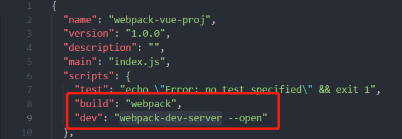
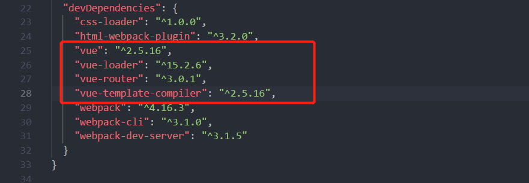
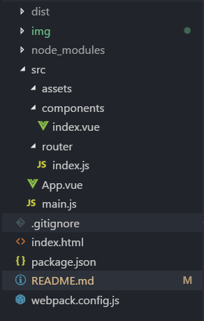

# webpack-vue-proj

## 什么是webpack？
webpack可以看作是一个模块打包器，webpack会从一个入口文件分析你的项目的依赖，处理你的依赖，转换为浏览器可运行的代码。

## webpack是基于node的
在项目的根目录下创建webpack.config.js的文件，执行webpack命令时会默认读取这个配置文件。
```js
//webpack.config.js
module.exports = {
    entry:'',//入口文件(可配置多入口文件)
    output:{},//出口文件
    module:{},//处理相应的模块
    plugins:[],//插件模块
    devserver:{},//服务器配置模块
    mode:"development",//打包模式(development or production)
}
```

## 最简单的webpack配置
下面来看一下最简单的webpack配置
```js
//webpack.config.js
conts path = require('path');//node自带处理文件路径模块

module.exports = {
    entry:'./src/main.js',//入口文件，webpack会从这个文件来分析项目依赖
    output:{
        filename:'bundle.js',//打包后的文件的名称
        path:path.resolve('dist')//打包后输出的位置
    }
}
```
在vue中我们都会通过npm run dev来开启服务器，npm run build来打包文件，那么我们就需要在package.json文件中配置命令行。


执行npm run dev时，我们需要安装通过npm install webpack-dev-server --save-dev 来安装这个npm包,安装完成后就可以启动一个服务器，在线预览我们的项目。

执行npm run build后，就执行打包命令生成了一个dist文件夹。

## 配置vue的开发环境

需要安装一下几个npm包:



目录结构如下(参考项目文件夹)：



我们需要在webpack.config.js中配置可处理.vue后缀的文件
```js
const path = require('path');
const VueLoaderPlugin = require('vue-loader/lib/plugin');
module.exports={
    ...
    module:{
        rules:[
            //处理.vue后缀的文件
            {
                test:/\.vue$/,
                use:['vue-loader']
            }
        ]
    },
    plugins:[
        new VueLoaderPlugin();//vue-loader v15+需要配合这个插件一起使用
    ]
    ...
}
```
随后配置main.js，App.vue，router下的index.js和添加components组件后，执行npm run dev，开启webpack服务器后就看到效果。

## 配置开发环境和生产环境
我们在使用vue-cli生成的项目中，可以看到webpack.base.config.js，webpack.dev.config.js和webpack.prod.config.js，这三个文件分别对应的是开发环境和生成环境共同的配置，开发环境的配置，生产环境的配置。需要我们在package.json命令行中指定为我们需要用哪个配置文件。


因为开发环境和生产环境有共同的配置，所以我们可以使用webpack-merge去合并(npm install webpack-merge --save-dev);

### 开发环境
开发环境主要配置webpack-dev-server
```js
//webpack.dev.conf.js
const baseConf = require('./webpack.base.conf');
const merge = require('webpack-merge');
const path = require('path');
const webpack = require('webpack');
const dev = {
    devServer:{
        contentBase:path.resolve(__dirname,'./dist'),
        port:8070,
        host: 'localhost',//设置为localhost时只能在本机访问。可改为0.0.0.0
        overlay: true,
        compress: true,
        open:true,
        hot: true,
        inline: true,
        progress: true,
    },
    plugins:[
        new webpack.HotModuleReplacementPlugin(),
        new webpack.NamedModulesPlugin(),
    ],
    devtool:'inline-source-map',
    mode:'development'
}

module.exports = merge(baseConf,dev);
```
### 生产环境
主要为生产环境配置了压缩混淆的插件
```js
//webpack.prod.confi.js
const merge = require('webpack-merge');
const baseConf = require('./webpack.base.conf');
const UglifyJsPlugin = require('uglifyjs-webpack-plugin');//混淆压缩
const prod={
    opimization:{
        minimizer:[
            new UglifyJsPlugin()
        ]
    },
    mode:'production'
}
module.exports = merge(baseConf,prod);
```


